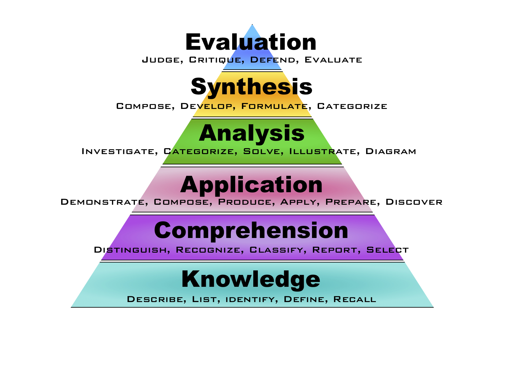
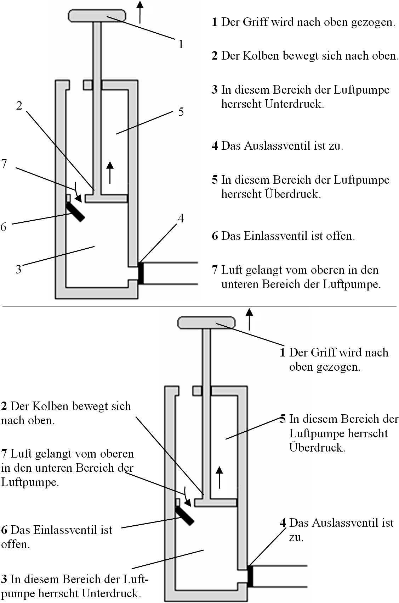
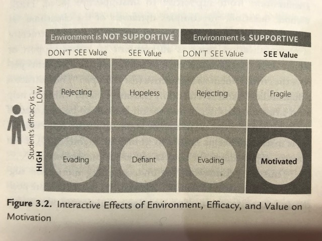
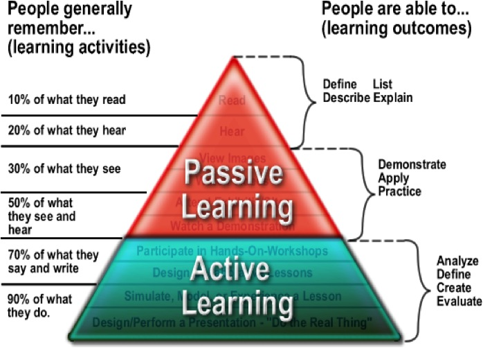

# Session 1

## Principles of learning and how they apply to training

## Topics of session 1
 * [How learning works](#learn)
 * [Our pedagogical model](#model)
 * [The Bloom's six categories of cognitive skills](#bloom)
 * [Teaching Objectives and Learning Outcomes](#learning)
 * [Declarative and procedural knowledge](#declarative)
 * [What is formal and non-formal learning?](#formal)
 * [Active Learning](#active)
 * [Novices *vs* experts in learning](#novice)
 * [Retention](#retention)
 * [Priming](#priming)
 * [Cognitive load](#cognitive)
 * [Research-based principles of learning and their implications for teaching practice](#principles)

### Introduction

---

>*Learning results from what the student does and thinks and only from what the student does and thinks. The teacher can advance learning only by influencing what the student does to learn* 
>
>[H.A. Simon](https://en.wikipedia.org/wiki/Herbert_A._Simon) (one of the founders of the field of [Cognitive Science](https://en.wikipedia.org/wiki/Cognitive_science) and Nobel Laureate)

---
This quotation from Herbert A. Simon clearly indicates that we cannot talk about teaching, teaching practices or effective teaching techniques if we don't understand first how people learn.  
Here, we want to share with you what we learnt about how learning works. Our knowledge in the field of cognition and learning comes from diving into pedagogical and cognitive research results, reading books such as ["How Learning Works"](https://www.amazon.it/How-Learning-Works-Research-Based-Principles/dp/0470484101) or ["Small Teaching"](http://eu.wiley.com/WileyCDA/WileyTitle/productCd-1118944496.html) and many others, studying research articles published in the field of cognitive science and educational psychology, attending instructor training courses (like this one), and - last but not least - from our own experience as both instructors/teachers, learners, and passionate observers of learning processes and teaching practices.  
Since this material cannot cover the broad literature on the subject of learning we strongly invite you to commit to read at least one book on how learning works (for example: ["How Learning Works"](https://www.amazon.it/How-Learning-Works-Research-Based-Principles/dp/0470484101) or ["Small Teaching"](http://eu.wiley.com/WileyCDA/WileyTitle/productCd-1118944496.html)), have a look at the [Software Carpentry Instructor training materials](http://swcarpentry.github.io/instructor-training/) and explore  the material we keep adding to the [doc](https://github.com/TrainTheTrainer/EXCELERATE-TtT/tree/master/docs) folder of the TrainTheTrainer/EXCELERATE-TtT GitHub repository.

### Terminology used in learning

Terminology used in learning is far from standardised. The several branches of the learning community have adopted different variants and occasionlly re-use terms in different contexts with slightly different meaning. [Here](doc/terminology.md) we try to offer a set of definitions that will help you to survive.

Out of this set, we propose a minimal subset of specific terms and concepts, that we need to know for this course. These are *cognition* and *metacognition*, *teaching* and *training*, and *teaching objectives (TO)* and *learning outcomes (LO)*. Each of these concepts will pop up several times in this materials. We will give their definition at the moment of introducing them. 

## How learning works
 
---

>### Challenge: How do you go about learning something new ? How do you approach learning new things? (3 min + 5 min)
<!--
> - Read about it
> - Attend a training session !
> - Have a go ?
> - Do, reflect, process, further understand?
>
--> 

> Which is the most effective approach for *you* to learn? 
> 
> Make a list of three approaches that work for you when you want to learn something new (from the most to the less effective one). Discuss it with your partner and compare. 
>
--- 
---

#### What is learning?

>From Ambrose et al. (2010) "How learning works":
>
- Learning is not a product but a process occurring in the mind. As such, we can only infer that it has occurred from students' products or performance
- Learning involves change in knowledge, beliefs, behaviours, or attitudes
- Learning is not something done to students, but rather **something students themselves do**.

> From Willingham (2009) "Why don't students like school?":
> 
- Learning is a change in the long term memory

#### Which learning theory?
Researchers in the field of cognitive sciences and educational psychology (the science of learning and teaching) have proposed a large number of learning theories. See for example the Holistic Approach to Techonology Enhanced Learning ([HoTEL](http://hotel-project.eu/sites/default/files/Learning_Theory_v6_web/Learning Theory.html)) website. 
Which ones should we rely on? Which one should we learn, teach and apply?

Learning is supported by a load of theories, some of them developed by schools of thought and large groups of enthusiastic followers. In the context of our session it may matter to recall some major points about them. It matters to say that most theories have been developed having the child learner in mind, so some aspects that reflect this bias will not apply to our activity. Adults' learning differs from children learning

**Behaviourism** (started in the early 20th century by John Broadus Watson):
* Learning is acquiring new behaviours by conditioning.
* Reflex response to stimuli
* Reward / Punishment
* * Ref: "Psychology as the Behaviorist Views It" , 1913

**Cognitivism** (started in 1920 by Jean Piaget):
* Learning is based on the development of cognitive capabilities.
* Its origin is in the "Gestalt Psychologie"

**Connectivism** (started in the 1980s by Stephen Downes and George Siemens):
* Knowledge is perceived from the environment and resides in connections.
* No agents form connections better than a learner's brain itself.
* The instructors act as facilitators. They create the environmental conditions that allow true learning to occur.

Ref: ["Knowing Knowledge”, George Siemens 2006](http:www.elearnspace.org/KnowingKnowledge_LowRes.pdf)

Connectivism is at the root of many present movements in learning, sometimes in a silent way (for example the Massive Open Online Courses also known as the MOOCs).
For a large number of reasons that we can - and should - discuss at length, connectivism is the standpoint that we find most suitable to support most of the design and implementation decisions in what concerns the training courses that we are concentrating on.

You have to know that some theories were validated by several experiments, whereas others were never confirmed. 
What it is important to know is that there is not a universal theory of learning but a number of evidence-based research results supporting some learning principles, which are today accepted and applied in several communities of practice. These principles are very well expressed in ["How Learning Works"](https://www.amazon.it/How-Learning-Works-Research-Based-Principles/dp/0470484101):

- **Principle P1**:	Students' prior knowledge can help or hinder learning.
- **Principle P2**:	How students organise knowledge influences how they learn and apply what they know.
- **Principle P3**:	Students motivation determines, directs and sustains what they do learn.
- **Principle P4**:	To develop mastery, students must acquire component skills, practice integrating them, and know when to apply what they have learned
- **Principle P5**:	Goal-directed practice coupled with targeted feedback enhances the quality of students' learning
- **Principle P6**:	Students' current level of development interacts with the social, emotional, and intellectual climate of the course to impact learning
- **Principle P7**:	To become self-directed learners, students must learn to monitor and adjust their approaches to learning.

We are not going to discuss these principles one by one, but you will notice that our pedagogical model strongly draws on them.

##Our pedagogical approach
 

Our pedagogical model is based on the following concepts, ideas, and models:

* The difference between teaching and training
* Adult learning or andragogy
* The Bloom's six categories of cognitive skills
* How thinking and memory work
* The acquisition of skills: novices, competent practicionners, experts
* Cognitive development and mental models
* The importance of the learning environment
* Active learning

### Teaching or Training?

>### Challenge: Based on your experience, what are in your opinion the differences between teaching and training? (5 min)

> Make a list of three main differences. Discuss with your partner(s). Write each on a different sticky note.
>

---
Here are sample definitions:

* **TEACHING**: Teaching is a process of educating a person with theoretical concepts and is a kind of a knowledge transfer between a teacher and a student. The role of the teacher is to act as a facilitator of learning by leading discussions, providing opportunities to ask open-ended questions, guiding the processes and tasks and enabling the active participation of learners and to engage with ideas ([source](http://www.differencebetween.com/difference-between-teaching-and-vs-training/)).
* **TRAINING**: Training is an approach used in short and intensive courses to build a person’s skills, knowledge and attitudes on a specific subject. Even though the person has attained the highest academic qualifications, still she may want or need to aquire specific knowledge and skills on a given topic.

And here is a list of differences adapted from [http://www.differencebetween.com/difference-between-teaching-and-vs-training/](http://www.differencebetween.com/difference-between-teaching-and-vs-training/):

 * Teaching is more related to theoretical concepts than training, which is rather related to the practical application of knowledge (i.e., development of **skills**).
 * Teaching seeks to impart new knowledge while training equips the already knowledgeable with tools and techniques to develop a specific skill set;
 * Teaching is, usually, within the context of education and academic environments, while training is associated with post-high school and/or post-graduate short and intensive courses;
 * Usually, teachers give feedback to their students, while trainers receive feedback from the learners; 

 However...
 
* Training is the process of teaching or learning a skill or job, and trainers do actually teach something. Therefore, training may encompass teaching;
* Teaching may also include typical training activities and goals, such as practicals; 
* Despite teaching and training techniques may sometime differ, the difference between training and teaching is not related with the process itself but with the focus: training generally has a more specific focus than teaching;
*  In order to build up as a competent professional, a person needs to have a go on understanding about the theoretical concepts as well as to have practical exposure. Therefore, teaching and training are equally important and sort of complementary concepts.

>#### "Instructor" *vs* "teacher" and "learner *vs* student"
In the context of training, we will prefer to use the term **instructor** instead of teacher or professor. We will tend to use the term **learner** instead of student. These choices are adopted just because they are more encompassing.

### Adult learning or andragogy

>###Challenge: what learner are you today?
> Think about your experience as a learner when you were at school, and now in this course. Write one thing in which you feel different as a learner today from the learner you were at school.
> Write it on a sticky note
> 

Compared to children, adults:

* are internally motivated 
* prefer to be active in decisions relating to their learning 
* they bring a lot of prior knowledge and experience to learning 
* need to have new knowledge linked with existing information
* are goal-oriented (so learning for learning's sake is unsatisfactory) * prefer learning what is authentic and directly relevant to their work or existing interests
* are more practical learners, wanting to be able to apply what is learned 
* prefer to be treated as partners in the learning experience

### The Bloom's six categories of cognitive skills

A group of educators, led by Benjamin Bloom, identified a hierarchy of six categories of cognitive skills (Bloom et al, 1956). As students learn, they start with the knowledge level and progress through the hierarchy. This is the process we are called upon to facilitate.

1.	**Remember/Reiterate** - performance is based on recognition of a seen example(s); 
2.	**Understand/Summarize** - performance summarizes information already known/given;
3.	**Apply/Illustrate** - performance extrapolates from seen examples to new ones by applying rules;
4.	**Analyze/Predict** - performance requires analysis and prediction, using rules;
5.	**Create/ Synthesize** - performance yields something innovative and novel, creating, describing and justifying something new from existing things/ideas;

The representation of the Bloom's hierarchy using a pyramid is aimed at stressing that "knowledge " is the foundation of everything: without knowledge, there is no comprehension, with no comprehension there is no application, and so forth. 
Critical thinking - which is the highest goal of learning - is only possible if it lays on the solid bases of the other five categories.
As instructors, we should make it possible for the learners to acquire the knowledge needed to develop a given skill, comprehend the  objects of their learning, be able to apply, analyse and synthetise the concepts we explain them, and finally to critically think and discuss about what they will have learnt in the course. 

### How can we use the Bloom's hierarchy of cognitive skills in teaching and training?
We can use the Bloom's taxonomy **to align instruction with learners' levels of complexity of thinking (and experience)**. 

How? We can use it to:

* write teaching objectives and learning outcomes
* design instruction and learning experiences
* assess learning

In defining the learning objectives and outcomes for your session or course, in designing instruction and learning experiences, and in assessing learning **you should be constantly aware of th Bloom's six categories**.

### Teaching objectives and Learning Outcomes

---
> Source: [Atherton J S (2013) Learning and Teaching; Objectives](http://www.learningandteaching.info/teaching/objectives.htm#ixzz4DtSAL2pi)
- Under Creative Commons License: Attribution Non-Commercial No Derivatives
>
---

**Objectives** are statements of what you are setting out to teach, although expressed as if the students were going to learn it. Despite Aims are usually intended to be more general and encompassing than Objectives, they are essential the same.

**Outcomes** (more accurately “desired outcomes”) are statements of what you might (in principle) assess. You may not end up assessing all of them, but they are statements of what a student will know or be able to do, if she or he has learned everything in the course or session.

**See also** the [PDF] (docs/Objectives_vs_Outcomes.pdf) document from the [Rensselaer Polytechnic Institute Office of the Provost](http://provost.rpi.edu/institutional-research)

>#### Learning objectives and learning outcomes
>
>These two terms are often used interchangeably by the community. Even worse, they are often abbreviated by the acronym (LO), thus introducing even more ambiguity. In our opinion there is no need. Objectives (aims or goals) and Outcomes (results) may overlap, but are not genuinely the same.
>
>Furthermore, American educational psychologists tend to use "Learning Objectives" to mean "Learning Outcomes" and "Teaching aims, goals or objectives" to mean "Learning Objectives".

In the attempt of removing ambiguities we will use the term **Teaching Objectives** to mean:

 * Objectives describe the goals and intentions of the instructor.
 * Objectives, often termed the input in the course, state the purpose and goals of the course.
 * Objectives focus on content and skills important within the classroom or programme.
 * Objectives may describe what the instructors will do.
 * Objectives can often be numerous, specific, and detailed.

And the term **Learning Oucomes** to mean:

 * Student Learning Outcomes catalog the overarching "products" of the course and are the evidence that the goals or objectives were achieved.
 * Learning Outcomes are statements that describe or list measurable and essential mastered content-knowledge—reflecting skills, competencies, and knowledge that students have achieved and can demonstrate upon successfully completing a course.
 * Outcomes express higher-level thinking skills that integrate course content and activities and can be observed as a behavior, skill, or discrete useable knowledge upon completing the
course.
 * Outcomes are exactly what assessments are intended to show – specifically what the student will be able to do upon completing the course.
 * An assessable outcome can be displayed or observed and evaluated against criteria.
 * Outcomes are clear and measurable criteria for guiding the teaching, learning, and assessment process in the course.

Adapted from [http://provost.rpi.edu/learning-assessment/learning-outcomes/objectives-vs-outcomes](http://provost.rpi.edu/learning-assessment/learning-outcomes/objectives-vs-outcomes)

### Writing Learning Outcomes using assessable verbs

In order to write learning outcomes, you can use the following scheme:

1) Think about what learners will be able to do by the end of instruction
2) Use the sentence: By the end of the lesson (session/course/instruction) the learner will be able to......... OR The successful learner will be able to......
3) Replace dots with a verb that you can assess (name, explain, solve, distinguish, etc.).  
4) Avoid verbs that are open to many interpretations: appreciate, have faith in, know, learn, understand, believe
5) Keep in mind that learning outcomes can be as specific as you want. You may even think about a different learning outcome for each task you assign to learners. 

[Here](docs/learning-outcomes.md) you will find a web-resource as well as a list of measurable verbs to assist you in writing and assessing learning outcomes.

>### Challenge
>
>Write a Teaching Objective AND a Learning Outcome for a session or a course you usually deliver.
>

### The acquisition of skills: novice, competent practicionner, expert
Another model of learning, which is somehow related to the Bloom's six categories of cognitive skills, is based on the [Dreyfus model of skill acquisition] (http://journals.sagepub.com/doi/10.1177/0270467604265061) (see the [Dreyfus model on Wikipedia](https://en.wikipedia.org/wiki/Dreyfus_model_of_skill_acquisition) and the [work of Patricia Benner](https://www.worldcat.org/search?q=au%3ABenner%2C+Patricia+E.&qt=hot_author#x0%253Abook- %2C%2528x0%253Abook%2Bx4%253Aprintbook%2529%2C%2528x0%253Abook%2Bx4%253Adigital%2529%2C%2528x0%253Abook%2Bx4%253Athsis%2529format))
This model suggests that learners acquire skills through distinct stages of learning. Dreyfus identifies five stages:

> #### From the [Carpentry Instructor Training](http://carpentries.github.io/instructor-training/) 
> The carpentries propose a simplified form of the model consisting in:

> **Novice**: someone who doesn’t even know what questions to ask.

> **Competent practitioner**: someone who has enough understanding for everyday purposes. They won’t know all the details of how something works and their understanding may not be entirely accurate, but it is sufficient for completing normal tasks with normal effort under normal circumstances.

> **Expert**: someone who can easily handle situations that are out of the ordinary.
> 

Other stages along a learning trajectory can be identified. For example, the developmental stages recognized in the European Guild structure are Novice, Beginner, Apprentice, and Journeyman. Whatever stages one uses, it is important to know that they can be aligned with the Bloom's levels, being - for example - the novice in a field at Bloom's level 1, early 2 (remember facts, understand some of them).

>### Challenge
>Think about a topic/field you feel you are a novice, a topic you feel you are a competent practitioner, and one you feel an expert, and share this with us.

Let's analyse the differences among these stages in terms of cognitive development, thinking, memory and learning.

### Mental models
A mental model is a collection of concepts and facts, along with the relationships between those concepts, that a person has about a topic or field. It is how people organise their knowledge. You can think of a graph with nodes (facts, concepts) and edges (connections). 

>### Challenge: What are the main differences between a novice and an expert in terms of knowledge and learning?
> - Think about yourself as a learner. 
> - How did you feel about something new when you were a student? How was to be a novice? Can you remember it?
> - How do you feel today when you have/want to learn something completely new to you? (e.g. you decide you want to learn painting but have no clues about painting techniques and the theory of colours). Does it happen sometimes?
> - How do you feel when you have to learn something new *in your field*? Namely, something that is an extension of your current knowledge about something (e.g. you know well a given OS and you need to learn how a different OS works).
> - Write at least two things in which novices and experts differ regarding knowledge.
> - Write at least two things in which novices and experts differ regarding learning.

A novice, typically has not yet built a mental model of the field. A competent practicionner has a mental model that works for many purposes, but will not be very accurate.

Experts, compared with novices and competent practitionners, differ in terms of the amount of knowledge and experience they own. This means that their mental model is richer in terms of number of nodes. 
Experts went through the process of learning several times in their lives, they have accumulated errors and have learnt how to face and fix them. They have also accumulated notions and facts. All in all, they know many more things than novices. 
But the amount of knowledge is not the only difference between non experts and experts. 
The way experts organise their knowledge is much more interconnected and causal than the way non experts do.
As stated by Ambrose et al. in *How learning works*: "Novice and expert knowledge organisations tend to differ in two key ways: the degree to which knowledge is sparsely versus richly connected, and the extent to which those connections are superficial versus meaningful."  
This means that both the density and the nature of connections matter.

This has important consequences in the learning process of novices and experts. Novices, besides learning new concepts and facts, do also need to create a densely connected and meaningful knowledge structure. 

This implies that instructors have to pay particular attention to this need and be aware that learners do not have the same knowledge organisation as they themselves have; furthermore, it is important that instructors identify teaching strategies aimed at revealing and enhancing students' knowledge organisation.

### Learners' prior knowledge and misconceptions

- **Principle P1**:	Students' prior knowledge can help or hinder learning.
- **Principle P2**:	How students organise knowledge influences how they learn and apply what they know.

####How can prior knowledge hinder learning? 

In many cases, prior knowledge is incomplete or inaccurate. Inaccurate beliefs can be termed “misconceptions” and can impede learning by making it more difficult for learners to incorporate new, correct information into their mental models.

There are three main classes of misconceptions:

- Simple factual errors. These are the easiest to correct.
- Broken models. We can address these by having learners reason through examples to see contradictions.
- Fundamental beliefs. These beliefs are deeply connected to the learner’s social identity and are the hardest to change.

In order to expose misconceptions (especially broken models), instructors need feedback on their learners’ progress, and insight into their learners’ mental models. This feedback comes through **formative assessments**.
Misconceptions can be managed through **reflective practice**, i.e., practice followed by feedback followed by further practice.

### Working memory, long term memory and learning

- **Principle P5**:	Goal-directed practice coupled with targeted feedback enhances the quality of students' learning

Another very simple model of the mind, is the following (Willingham, 2009):

**Environment**: full of things to see and hear, problem to be solved etc. 

**Working memory**: component of your mind (synonymous of consciousness). It is where thinking occurs. It is the part of your mind where you are aware of what is around you.

**Long-term memory**: vast storehousein which you mantain your factual knowledge of the world. Information in long-term memory resides outside of awareness.

Thinking occurs when you combine information (from the environment and long-tern memory) in new ways. That combining happens in working memory.

Learning is a change of the long-term memory.

Long-term memory contains not only factual information, but also procedural knowledge, which is your knowledge of the mental procedures necessary to execute tasks. It is like a recipe to accomplish a particular type of thought. 

Working memory is very fast but has very limited space. Several experiments showed that we can hold in the working memory up to 7 +/- 2 items. Try this [short test of working memory](https://cat.xula.edu/thinker/memory/working/serial).

Long-term memory is slow to access but it is essentially unbounded. 

The fact that working memory has limited space, implies that thinking becomes increasingly difficult as working memory gets crowded. 

In order to facilitate comprehension, thinking and learning, it is necessary to make room in working memory. This makes it easier to relate ideas, and therefore to comprehend and critically think. 

###What can we do to make room in working memory?

- Increase our background knowledge
- Avoid extraneous cognitive load

####Increase our background knowledge
We can increase background knowledge (both factual and procedural). Indeed, it has been shown that background knowledge is essential to reading comprehension, critical thinking and is necessary for cognitive skills and learning. 

>###Challenge (Willingham, 2009): How many letters can you remember?
>X C N  
>N P H  
>D F B  
>I C I  
>A N C  
>A A X  

>Now try the same task with this list:
>
>X  
>C N N  
>P H D  
>F B I  
>C I A  
>N C A A  
>X  
>
>-------

This is a working memory task.
The reason why you remember many more letters from the second list is because the letters form acronyms that are familiar. Indeed, the amount of space in working memory does not depend on the number of letters; it depends on the **number of meaningful objects**.

The phenomenon of tying together separate pieces of information from the environment is called *chuncking*. You can keep more stuff in working memory if it can be chunked. 

The trick, however, is that chunking works only when you have applicable factual knowledge in long-term memory. You will see PHD as meaningful only if you already know what PHD is. 

This example shows how to use background knowledge to group things in working memory, thus making more room in working memory. 

Most problems are solved by comparing them to cases you have seen in the past, namely to your background knowledge.

Furthermore, factual knowledge improves your memory. Indeed, it is easier to remember material if you already know something about the topic and having factual knowledge in long-term memory makes it easier to acquire still more factual knowledge. 

These concepts can be easily reconnected to the graph model of our mind: the more the graph is rich and densely connected (corresponding to deep background knowledge) the easier it will be to make it richer and more densely connected. In other words, the more we know, the better we learn, remember and think. 

Other factors facilitating memory:

- things that create an emotional reaction will be better remembered, but emotion is not necessary for learning (and it is definitely not sufficient!)
- if you don't pay attention to something, you can't learn it
- repetition helps but repetition alone is not sufficient
- wanting to remember something has little or no effect
- thinking about meaning is good for memory
- practice makes learning long lasting
- spaced practice is of great benefit for memory

### Avoid extraneous cognitive load

---
>Source: Cognitive load - [Wikipedia](https://en.wikipedia.org/wiki/Cognitive_load)
>
> References:
>
> - Sweller, J., Cognitive load during problem solving: Effects on learning, Cognitive Science, 12, 257-285 (1988)
> - Sweller, J., Instructional Design in Technical Areas, (Camberwell, Victoria, Australia: Australian Council for Educational Research (1999)
>
---

In cognitive psychology, cognitive load refers to the total amount of mental effort being used in the working memory. Cognitive load theory was developed out of the study of problem solving by John Sweller in the late 1980s. Sweller argued that instructional design can be used to reduce cognitive load in learners. 
Cognitive load theory differentiates cognitive load into three types: intrinsic, extraneous, and germane.

**Intrinsic cognitive load** is the effort associated with a specific topic. 

**Germane cognitive load** refers to the work put into creating a permanent store of knowledge, or a schema. It is the (desirable) mental effort required to create linkages between new information and old (which is one of the things that distinguishes learning from memorization)

**Extraneous cognitive load** is everything else that distracts or gets in the way. Extraneous cognitive load refers to the way information or tasks are presented to a learner. 

Examples: 

- A square is a figure and should be described using a figural medium
- Split attention effect

Cognitive load theory’s proponents claim that eliminating extraneous cognitive load accelerates learning.

### The learning environment

- Motivation and demotivation
- Mindset

> From Ambrose et al. 2010

>**Value**: the goal is valued (attainment value - satisfaction that one gains from mastery and accomplishment of a goal or task -, intrinsic value and motivation - the satisfaction that one gains simply from doing the task rather than from a parricular outcome of the task, instrumental value/extrinsic rewards - praise, punlic recognition, money, material goods, an interesting career, a high-status job, etc.)  
>**Efficacy**: positive outcomes expectancies for success (growth vs fixed mindset) - Efficacy expetancies represent the belief that onw is capable of identifying, organising, initiating, and executing a course of action that will bring about a desired outcome (Bandura, 1997). So, in order to hold a positive expectancy for success, a student must not only believe that doing the assigned work can earn a passing grade (growth mindset), she must also believe that she is capable of doing the work necessary to earn a passing grade 
>**Environment**: complex dynamics of the classroom, its tone, the interpersonal forces at play, the nature and structure of communication patterns. E.g. "The instructor is approachable and several of my classmates seem willing to help me if I run into troubles".  

## Active learning

> “I hear and I forget. I see and I remember. I do and I understand.”
– Confucius

>"Learners who actively engage with course materials will end up retaining it for much longer than they would have otherwise, and they will be better able to apply their knowledge broadly." (Waldrop, Nature 2015).

Active learning requires students to participate in class, as opposed to sitting and listening quietly. Strategies include, but are not limited to, brief question-and-answer sessions, discussion integrated into the lecture, impromptu writing assignments, hands-on activities and experiential learning events. 

Active learning is anything course-related that all students in a class session are called upon to do other than simply watching, listening and taking notes ([Felder and Brent, 2011](./doc/active_learning_an_introduction.pdf)).

> ###Further reading and watching:
> 
> * R.M. Felder and R. Brent "Active learning: an introduction" ([PDF](./doc/active_learning_an_introduction.pdf))
> * Michael Prince - Does Active Learning Work? A Review 
of the Research ([PDF](./doc/Prince-does_active_learning_work.pdf)) 
> * [Mazur's video on Peer Instruction for Active Learning]
(https://www.youtube.com/watch?v=Z9orbxoRofI)

---------------------------------------------------------------------
## Further reading

### Retention

Memorisation is part of the learning process. Memorising facts and rules happens in the context of the much more complex learning process where they need to articulate. It so happens that failure to memorise makes most of the learning impractical or at least inneficient.

To learn, we need to be able to memorise - and we actually choose what - and we actually also need to forget. This process is called retention. 

Rote learning methods can produce memorisation, but are exclusively based on repetition. The absence of a proper context, meaning and association is a serious obstacle to the acquisition of proper understanding. Therefore, rote methods have a very limited scope of application in learning. Alternatively, instructors need to opt for active learning or even deep learning methods.

In active learning, the learner actively participates in the construction of his/her new knowledge. 
Whereas in deep learning, the learner develops his/her own organisation scheme/framework where the new knowledge merges with previously acquired knowledge and new meaningful associations emerge logically.

Short term memory (STM) has an evanescent behaviour. Repetition, as on rote learning, is maximally effective in producing long term memory (LTM), when not delivered all at once. Paced repetition combines recall with new memorisation, as typically shown in 
http://com.msu.edu/Students/Academic_Guidance/long_term_retention_recall.pdf

### Priming
What Is Priming?

Priming is a nonconscious form of human memory concerned with perceptual identification of words and objects. It refers to activating particular representations or associations in memory just before carrying out an action or task. For example, a person who sees the word "yellow" will be slightly faster to recognize the word "banana." This happens because yellow and banana are closely associated in memory. Additionally, priming can also refer to a technique in psychology used to train a person's memory in both positive and negative ways. 
Source: https://www.psychologytoday.com/basics/priming

Priming in Training

Active learning environmemnts can benefit from what is known about priming. Careful training designs can expose learners to materials that prime the subject matter positively. By showing infographics or diagrams that summarise essential items that need to be memorised to fully understand or recall a subject.  In pretty much the same way, exposure to high impact videos can very effectively impact learning with negative priming, for example while instructors are inducing the learners to replace preconceived ideas or myths. Quite often, certain learners need this kind of help to articulate ways of freeing "space" for novel learning to take place.

### What is formal and non-formal learning?

> Reference source: [http://www.oecd.org/edu/skills-beyond-school/recognitionofnon-formalandinformallearning-home.htm](http://www.oecd.org/edu/skills-beyond-school/recognitionofnon-formalandinformallearning-home.htm)
>
We quote:
>
"**Formal learning** is always organised and structured, and has learning objectives. From the learner’s standpoint, it is always intentional: i.e. the learner’s explicit objective is to gain knowledge, skills and/or competences. Typical examples are learning that takes place within the initial education and training system or workplace training arranged by the employer. One can also speak about formal education and/or training or, more accurately speaking, education and/or training in a formal setting. This definition is rather consensual.
>
**Informal learning** is never organised, has no set objective in terms of learning outcomes and is never intentional from the learner’s standpoint. Often it is referred to as learning by experience or just as experience. The idea is that the simple fact of existing constantly exposes the individual to learning situations, at work, at home or during leisure time for instance. This definition, with a few exceptions (see Werquin, 2007) also meets with a fair degree of consensus.
>
Mid-way between the first two, **non-formal learning** is the concept on which there is the least consensus, which is not to say that there is consensus on the other two, simply that the wide variety of approaches in this case makes consensus even more difficult. Nevertheless, for the majority of authors, it seems clear that non-formal learning is rather organised and can have learning objectives. The advantage of the intermediate concept lies in the fact that such learning may occur at the initiative of the individual but also happens as a by-product of more organised activities, whether or not the activities themselves have learning objectives. In some countries, the entire sector of adult learning falls under non-formal learning; in others, most adult learning is formal. Non-formal learning therefore gives some flexibility between formal and informal learning, which must be strictly defined to be operational, by being mutually exclusive, and avoid overlap."

In this concern, a bioinformatics training course will most often be best classified as a NON-FORMAL learning instance.
Whereas a semester course in a university would most often be classified as FORMAL and an impromptu demonstration session on RNA-seq could be better classified as INFORMAL learning.

We may pragmatically think of EFFICIENT bioinformatics training provision in the following NON-FORMAL way
* It provides essentially skills, rather than deep knowledge
* It aims at the acquisition of competences
* It must focus on the learner (learner-centric)
* It must guarantee that independently reproducible outcomes are obtained
* The learners must acquire autonomy (skills usage independence)

The EFFICIENCY of training can - and should - be independently assessed by the capability of reaching the desired OUTCOMES, in the context of the stated OBJECTIVES.

Please bear in mind that we are speaking about educating ADULTS. This is important because adults have their interests focused of their self-improvement, and see training as a capacity-building exercise. Adults like to be respected as such, that their expectations are individually met, in an exhaustive way.

> Reference: “The Adult Learner”, Malcom Knowles,ElwoodHolton & Richard Swanson, 7th ed 2011

---

## References

Ambrose SA, Bridges MW, DiPietro M, Lovett MC, Marie K. Norman MK, Richard E. Mayer RE (2010) How learning works: Seven research-based principles for smart teaching. ISBN: 978-0-470-48410-4 

Anderson LW, Krathwohl DR, Airasian PW, Cruikshank KA, Mayer RE, Pintrich PR, Raths J, Wittrock MC. (Eds.) (2001). A Taxonomy for Learning, Teaching and Assessing: A Revision of Bloom's Taxonomy of Educational Objectives. Addison Wesley Longman, Inc.: White Plains, NY.

Bloom BS (Ed.), with Engelhart MD, Furst EJ, Hill WH & Krathwohl DR. (1956).  Taxonomy of educational objectives: Handbook I: Cognitive domain.  New York, NY: David McKay.

[Brent R and Felder RM (2011)](docs/how_learning_works_thoughts.pdf)

Knowles M. “The Adult Learner”, ElwoodHolton & Richard Swanson, 7th ed 2011.

Willingham DT (2009) Why Don't Students like School? Jossey-Bass, A Wiley Imprint, San Francisco, CA.

