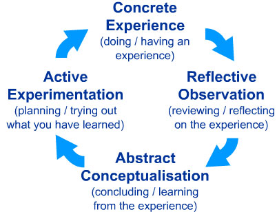

#ELIXIR – EXCELERATE Train the Trainer subtask

## Session 1: Review of learning principles and how they apply to training

 * [Terminology used in learning;](#term)
 * [Learning aims, objectives and outcomes;](#learning)
 * [The Bloom's six categories of cognitive skills](#bloom)
 * [How learning works: research-based principles of learning and their implications for teaching practice;](#works)
 * [What is formal and non-formal learning?](#formal)
 * [Relevant models from cognitive science;](#relevant)
 * [Cognitive load.](#cognitive)

###Introduction

---

>*Learning results from what the student does and thinks and only from what the student does and thinks. The teacher can advance learning only by influencing what the student does to learn* 
>
>[H.A. Simon](https://en.wikipedia.org/wiki/Herbert_A._Simon) (one of the founders of the field of [Cognitive Science](https://en.wikipedia.org/wiki/Cognitive_science) and Nobel Laureate)

---

This quotation from Herbert A. Simon clearly indicates that we cannot talk about teaching, teaching practices or effective teaching techniques if we don't understand first how people learn.  
Here, we want to share with you what we learnt about how learning works. Our knowledge in the field of cognition and learning comes from diving into pedagogical and cognitive research results, reading books such as ["How Learning Works"](https://www.amazon.it/How-Learning-Works-Research-Based-Principles/dp/0470484101) or ["Small Teaching"](http://eu.wiley.com/WileyCDA/WileyTitle/productCd-1118944496.html) and many others, studying research articles published in the field of cognitive science and pedagogy, attending instructor training courses (like this one), and - last but not least - from our own experience as both instructors/teachers, learners, and passionate observers of learning processes and teaching practices.

###Terminology used in learning

Most definitions are taken from the [Glossary of Online Learning Terms](http://theelearningcoach.com/resources/online-learning-glossary-of-terms/); see also the Glossary of "Learning" Terms, Georgia Institute of Technology [(PDF)](docs/learningterms.pdf).

####Terminology used in learning

Terminology used in learning is far from standardised. The several branches of the learning community have adopted different variants and occasionlly re-use terms in different contexts with slightly different meaning. Here we try to offer sets of definitions that will help you to survive.

Before we do that, let us propose a minimal subset of specific terms, by choice, that we will try to use in the context of bioinformatics training in  a  consistent way. We will prefer to use the term INSTRUCTOR  instead of teacher or professor. We will use the term LEARNER instead of student. These choices are adopted just because they are more encompassing.

Here we offer lists of definitions that seem useful. Inevitably, for the reasons isted above, you will find inconsistencies here  and there. You will need to learn how to deal with the situation.

In the following list, most definitions are taken from the [Glossary of Online Learning Terms](http://theelearningcoach.com/resources/online-learning-glossary-of-terms/); see also the Glossary of "Learning" Terms, Georgia Institute of Technology [(PDF)](docs/learningterms.pdf).

* **ACTIVE LEARNING**: A process whereby learners are actively engaged in the learning process, rather than "passively" absorbing lectures. Active learning involves reading, writing, discussion, and engagement in solving problems, analysis, synthesis, and evaluation. Active learning often involves cooperative learning (from the [Glossary of education terms on Wikipedia](https://en.wikipedia.org/wiki/Glossary_of_education_terms)).
* **ASYNCHRONOUS LEARNING**: When learners participate in an online learning course at different times. This might also be called eLearning or web-based training (WBT). Asynchronous learning allows learners to go through a course at their own pace and on their own schedule.
* **BLENDED LEARNING or HYBRID LEARNING**: It is an instructional approach that includes a combination of online and in-person learning activities. For example, students can complete online self-paced assignments by a certain date and then meet on-site or online for additional learning activities.
* **COGNITION**: "The mental action or process of acquiring knowledge and understanding through thought, experience, and the senses." (from the Oxford dictionary). Cognition encompasses processes such as knowledge, attention, memory and working memory, judgment and evaluation, reasoning and "computation", problem solving and decision making, comprehension and production of language, etc. Human cognition is conscious and unconscious, concrete or abstract, as well as intuitive (like knowledge of a language) and conceptual (like a model of a language). Cognitive processes use existing knowledge and generate new knowledge. ([For more see Wikipedia](https://en.wikipedia.org/wiki/Cognition))
* **COURSEWARE**: Courseware refers to any instructional software that is delivered on a computer.
* **DISTANCE EDUCATION or DISTANCE LEARNING**: Distance Education/Learning occurs when students and their instructors are in different geographical locations and the instruction occurs on an electronic device, such as a computer or mobile phone. The learning can occur in a synchronous environment, in which all participants are connected at the same time or in an asynchronous environment, when participants are engaged in learning at different times.
* **eLEARNING**:eLearning (short for electronic learning) is an umbrella term that refers to all types of training, education and instruction that occurs on a digital medium, like a computer or mobile phone. The term evolved from Enhanced Learning which was actually more encompassing and acccurate.
* **INFORMAL LEARNING**: Informal learning occurs when people have a need to know something. They set their own learning objectives and acquire knowledge, skills and information in their own ways. This could be through asking questions, observing experts, practicing and conversing. It’s the kind of natural learning humans do outside of a structured environment.
* **INSTRUCTIONAL DESIGN**: Instructional design involves the identification of the knowledge, information, and skill gaps of a particular group of people and creating or selecting learning experiences that close this gap. Instructional designers base their learning decisions on cognitive psychology, instructional theory and best practices.
* **INSTRUCTOR LED TRAINING (ILT)**: ILT typically refers to providing instruction in a classroom environment where the instructor and learners are together at the same time and in the same physical location.
* **LEARNING OBJECTIVES**: Learning objectives describe the goals and intentions of the instructor who teaches the course. They state the purpose and goals of a session or of the course.
* **LEARNING OUTCOMES**: A Learning Outcome is an outcome statement that captures specifically what knowledge, skills, attitudes learners should be able to exhibit following instruction.
* **INSTRUCTOR LED TRAINING (ILT)**: ILT typically refers to providing instruction in a classroom environment where the instructor and learners are together at the same time and in the same physical location.
* **MOBILE LEARNING**: Learning that takes place on a hand-held device, such as a mobile phone, that can take place anytime and anywhere.
* **MULTIMEDIA**: Multimedia refers to the presentation of information and instruction through a combination of graphics, audio, text, or video. Multimedia instruction is often interactive.
* **ONLINE LEARNING**: The term online learning is often used synonymously with eLearning. It is an umbrella term that includes any type of learning accomplished on a computer and usually over the Internet.
* **SELF-PACED LEARNING**: Self-paced learning refers to the type of instruction that allows a person to control the flow of the courseware. It implies the learning environment is asynchronous.
* **SOCIAL MEDIA LEARNING**: Social media learning refers to the acquisition of information and skills through social technologies that allow people to collaborate, converse, provide input, create content and share it. Examples of social media learning can occur through online social networking platforms, blogs and microblogs (like Twitter), online talk radio and wikis.
* **SYNCHRONOUS LEARNING**: When learners participate in an online learning course at the same time but in different locations, it is known as synchronous learning. Synchronous learning allows learners to interact with the instructor and other participants. This is done through software that creates a virtual classroom.
* **TEACHING**
* **TRAINING**
* **VIRTUAL CLASSROOM**: The virtual classroom refers to a digital classroom learning environment that takes place over the Internet rather than in a physical classroom. It is implemented through software that allows an instructor and students to interact.
* **WEB-BASED TRAINING (WBT)**: WBT refers to all types of digital instruction in which the learning material is presented via the Internet.

###Teaching or Training?

###Learning aims, objectives and outcomes

---
> Source: [Atherton J S (2013) Learning and Teaching; Objectives](http://www.learningandteaching.info/teaching/objectives.htm#ixzz4DtSAL2pi)
- Under Creative Commons License: Attribution Non-Commercial No Derivatives
>
---

**Aims** are broad statements of what learning the instructor hopes to generate. The **aim** is the point of the whole thing. As such, even hard-liners concede that it can be fairly vague, and non-behavioural terms, such as “understand”, and “appreciate” or “develop” are rather reluctantly accepted. The Aim is almost certainly more than the sum of the Objectives, and regardless of what many people say, the Aim is what matters. It is the End, and all the rest is just Means.

**Objectives** are statements of what you are setting out to teach, although expressed as if the students were going to learn it..

**Outcomes** (more accurately “desired outcomes”) are statements of what you might (in principle) assess. You may not end up assessing all of them, but they are statements of what a student will know or be able to do, if she or he has learned everything in the course or session.

**See also** the [PDF] (docs/Objectives_vs_Outcomes.pdf) document from the [Rensselaer Polytechnic Institute Office of the Provost](http://provost.rpi.edu/institutional-research)

####Learning objectives and learning outcomes

These two terms are often used interchangeably by the community. Even worse, they are often abbreviated by the acronym (LO), thus introducing even more ambiguity. In our opinion there is no need. Objectives (aims) and Outcomes (results) may overlap, but are not genuinely the same.

Here is an attempt to clarify this situation and remove the ambiguities:

###Learning Objectives
 * Objectives describe the goals and intentions of the instructor.
 * Objectives, often termed the input in the course, state the purpose and goals of the course.
 * Objectives focus on content and skills important within the classroom or program.
 * Objectives may describe what the instructors will do.
 * Objectives can often be numerous, specific, and detailed.

###Learning Outcomes
 * Student Learning Outcomes catalog the overarching "products" of the course and are the
evidence that the goals or objectives were achieved.
 * Learning Outcomes are statements that describe or list measurable and essential mastered
content-knowledge—reflecting skills, competencies, and knowledge that students have
achieved and can demonstrate upon successfully completing a course.
 * Outcomes express higher-level thinking skills that integrate course content and activities and
can be observed as a behavior, skill, or discrete useable knowledge upon completing the
course.
 * Outcomes are exactly what assessments are intended to show – specifically what the student
will be able to do upon completing the course.
 * An assessable outcome can be displayed or observed and evaluated against criteria.
 * Outcomes are clear and measurable criteria for guiding the teaching, learning, and
assessment process in the course.

Adapted from [http://provost.rpi.edu/learning-assessment/learning-outcomes/objectives-vs-outcomes](http://provost.rpi.edu/learning-assessment/learning-outcomes/objectives-vs-outcomes)

####Learning outcomes should be SMART
||||
|---------------------|---------------|--------------|
|Specific|They should state clearly what the student should know/be able to do, and at what level|What?|
|Measurable|You should be able to conceive of how their attainment might be assessed|By trainee / trainer or both?|
|Achievable| by the learners|Is it possible in this context?|
|Realistic|Could be seen as similar to attainability, but refers to their appropriateness to the overall task. "Valid" in assessment-speak|Can we really train them to do this?|
|Time-limited|Or achievable within the time-span of the session/lesson/course|In what time?|

###The Bloom's six categories of cognitive skills

**Bloom's Taxonomy of Educational Objectives (1956) - Cognitive Skills**: A group of educators, led by Benjamin Bloom, identified a hierarchy of six categories of cognitive skills: knowledge, comprehension, application, analysis, synthesis and evaluation.  As students learn, they start with the knowledge level and progress through the hierarchy.  Thus, advanced courses should include skills at a higher level than introductory or basic skills courses.  Below you will find a web-resource as well as a list of measurable verbs to assist you in writing course objectives and assess learning outcomes.

####From taxonomy to verbs…

**Verbs that are often used but are better to avoid because they are open to many interpretations**: appreciate, have faith in, know, learn, understand, believe.

[**Blooms levels of taxonomy**](docs/Blooms_levels_of_taxonomy.pdf)

|Level|Definition|Verbs|
|---------------------|---------------|---------------|
|Knowledge | The successful student will recognize or recall learned information| list, record, underline, state, define, arrange, name, relate, describe, tell, recall, memorise, recall, repeat, recognise, label, select, reproduce|
|Comprehension|The successful student will restate or interpret information in their own words|explain, describe, report, translate, express, summarise, identify classify, discuss, restate, locate, compare, review, illustrate, tell, critique, estimate, reference, interpret, reiterate|
|Application|The successful student will use or apply the learned information|apply, sketch, perform, use, solve, respond, practice, construct, role-play, demonstrate, conduct, execute, complete, dramatise, employ|
|Analysis|The successful student will examine the learned information critically|analyse, inspect, test, distinguish, catergorise, critique, differenciate, catalogue, diagnose, appraise, quantify, extrapolate, calculate, measure, theorise, experiment, relate, debate|
|Synthesis|The successful student will create new models using the learned information| develop, revise, compose, plan, formulate, collect, build, propose, construct, create, establish, prepare, design, integrate, devise, organise, modify, manage|
|Evaluation|The successful student will assess or judge the value of learned information|review, appraise, chose, justify, argue, conclude, assess, rate, compare, defend, score, evaluate, report on, select, interpret, investigate, measure, support|

Source: [List of Measurable Verbs Used to Assess Learning Outcomes ](https://www.clinton.edu/curriculumcommittee/listofmeasurableverbs.cxml)

**Writing Objectives Using Bloom's Taxonomy**:

|Level|Questions|
|---------------------|---------------|
|Knowledge | What is ...? How is ...? Where is ...? When did _______ happen? How did ______ happen? How would you explain ...? Why did ...? How would you describe ...? When did ...? Can you recall ...? How would you show ...? Can you select ...? Who were the main ...? Can you list three ...? Which one ...? Who was ...?|
|Comprehension|How would you classify the type of ...? How would you compare ...? contrast ...? Will you state or interpret in your own words ...? How would you rephrase the meaning ...? What facts or ideas show ...? What is the main idea of ...? Which statements support ...? Can you explain what is happening . . . what is meant . . .? What can you say about ...? Which is the best answer ...? How would you summarize ...?|
|Application|How would you use ...? What examples can you find to ...? How would you solve _______ using what you have learned ...? How would you organize _______ to show ...? How would you show your understanding of ...? What approach would you use to ...? How would you apply what you learned to develop ...? What other way would you plan to ...? What would result if ...? Can you make use of the facts to ...? What elements would you choose to change ...? What facts would you select to show ...? What questions would you ask in an interview with ...?|
|Analysis|What are the parts or features of ...? How is _______ related to ...? Why do you think ...? What is the theme ...? What motive is there ...? Can you list the parts ...? What inference can you make ...? What conclusions can you draw ...? How would you classify ...? How would you categorize ...? Can you identify the difference parts ...? What evidence can you find ...? What is the relationship between ...? Can you make a distinction between ...? What is the function of ...? What ideas justify ...?|
|Synthesis|What changes would you make to solve ...? How would you improve ...? What would happen if ...? Can you elaborate on the reason ...? Can you propose an alternative ...? Can you invent ...? How would you adapt ________ to create a different ...? How could you change (modify) the plot (plan) ...? What could be done to minimize (maximize) ...? What way would you design ...? What could be combined to improve (change) ...? Suppose you could _______ what would you do ...? How would you test ...? Can you formulate a theory for ...? Can you predict the outcome if ...? How would you estimate the results for ...? What facts can you compile ...? Can you construct a model that would change ...? Can you think of an original way for the ...?|
|Evaluation|Do you agree with the actions ...? with the outcomes ...? What is your opinion of ...? How would you prove ...? disprove ...? Can you assess the value or importance of ...? Would it be better if ...? Why did they (the character) choose ...? What would you recommend ...? How would you rate the ...? What would you cite to defend the actions ...? How would you evaluate ...? How could you determine ...? What choice would you have made ...? What would you select ...? How would you prioritize ...? What judgment would you make about ...? Based on what you know, how would you explain ...? What information would you use to support the view ...? How would you justify ...? What data was used to make the conclusion ...? Why was it better that ...? How would you prioritize the facts ...? How would you compare the ideas ...? people ...?|
Source: [Writing Objectives Using Bloom's Taxonomy ](http://teaching.uncc.edu/learning-resources/articles-books/best-practice/goals-objectives/writing-objectives)

###How learning works: research-based principles of learning and their implications for teaching practice

---

>###Challenge: How do you go about learning something new ? How do you approach learning new things?
<!--
> - Read about it
> - Attend a training session !
> - Have a go ?
> - Do, reflect, process, further understand?
>
--> 

> Which is the most effective approach for *you* to learn? Make a list of three approaches that work for you when you want to learn something new (from the most to the less effective one). Discuss it with your partner and compare. 
>
--- 

---
> Source:
> How learning works: Seven research-based principles for smart teaching
> By Susan A. Ambrose, Michael W. Bridges, Michele DiPietro, Marsha C. Lovett, Marie K. Norman, Richard E. Mayer
ISBN: 978-0-470-48410-4

---

See also: [The Eberly Center for Teaching Excellence and Educational Innovation ](http://www.cmu.edu/teaching/)

"Learning results from what the student does and thinks and only from what the student does and thinks. The teacher can advance learning only by influencing what the student does to learn" (H.A. Simon)

**What is learning?**

- Learning is not a product but a process occurring in the mind. As such, we can only infer that it has occurred from students' products or performance
- Learning involves change in knowledge, beliefs, behaviours, or attitudes
- Learning is not something done to students, but rather something students themselves do.

**The seven principles of learning**:

- **Principle P1**:	Students' prior knowledge can help or hinder learning.
- **Principle P2**:	How students organise knowledge influences how they learn and apply what they know.
- **Principle P3**:	Students motivation determines, directs and sustains what they do learn.
- **Principle P4**:	To develop mastery, students must acquire component skills, practice integrating them, and know when to apply what they have learned
- **Principle P5**:	Goal-directed practice coupled with targeted feedback enhances the quality of students' learning
- **Principle P6**:	Students' current level of development interacts with the social, emotional, and intellectual climate of the course to impact learning
- **Principle P7**:	To become self-directd leaners, students must learn to monitor and adjust their approaches to learning.

**Instructional strategies that collectively address all seven principles (P1-P7)**:

- **Strategy S1**: Collect data about students and use it to design instruction (P1,P3).
- **Strategy S2**: Be explicit about your learning goals, learning objectives and expecations (P3, P5, P6). Make your learning goals challenging but attainable by most of the learners in your course. Write detailed learning outcomes that spell out what the learners should be able to do (define, explain, calculate, model, critique, design,...) if they have aquired the knowledge and skills you are trying to help them to develop, and share your objectives with the learners.
- **Strategy S3**: Scaffold complex tasks (P2-P7). Teach and test at a level that is challenging but not too far above the learners' current klnowledge and skill levels.
- **Strategy S4**: Help learners learn to funcion like experts (P2, P4, P7). Have learners formulate solution strategies before beginning to work on new problems, and when they complete assignments have them reflect on what they learned and what they will do differently in the future.
- **Strategy S5**: Establish a supportive class climate (P3, P6). Learn and use learners' names and encourage them to interact with you in and out the course. Collect anonymous learner feedback and investigate and respond to any complaints related to class climate.

**See also**: [Brent R and Felder RM (2011)](docs/how_learning_works_thoughts.pdf)

1.	How students organise knowledge influences how they learn and apply what they know
2.	Students motivation determines, directs and sustains what they do learn
3.	To develop mastery, students must acquire component skills, practice integrating them, and how and when to apply what they have learned
4.	Goal-directed practice coupled with targeted feedback enhances the quality of students' learning
5.	Students' current level of development interacts with the social, emotional, and intellectual climate of the course to impact learning
6.	To become self-directd leaners, students must learn to monitor and adjust their approaches to learning.

###What is formal and non-formal learning?

Reference source http://www.oecd.org/edu/skills-beyond-school/recognitionofnon-formalandinformallearning-home.htm

We quote:

"Formal learning is always organised and structured, and has learning objectives. From the learner’s standpoint, it is always intentional: i.e. the learner’s explicit objective is to gain knowledge, skills and/or competences. Typical examples are learning that takes place within the initial education and training system or workplace training arranged by the employer. One can also speak about formal education and/or training or, more accurately speaking, education and/or training in a formal setting. This definition is rather consensual.

Informal learning is never organised, has no set objective in terms of learning outcomes and is never intentional from the learner’s standpoint. Often it is referred to as learning by experience or just as experience. The idea is that the simple fact of existing constantly exposes the individual to learning situations, at work, at home or during leisure time for instance. This definition, with a few exceptions (see Werquin, 2007) also meets with a fair degree of consensus.

Mid-way between the first two, non-formal learning is the concept on which there is the least consensus, which is not to say that there is consensus on the other two, simply that the wide variety of approaches in this case makes consensus even more difficult. Nevertheless, for the majority of authors, it seems clear that non-formal learning is rather organised and can have learning objectives. The advantage of the intermediate concept lies in the fact that such learning may occur at the initiative of the individual but also happens as a by-product of more organised activities, whether or not the activities themselves have learning objectives. In some countries, the entire sector of adult learning falls under non-formal learning; in others, most adult learning is formal. Non-formal learning therefore gives some flexibility between formal and informal learning, which must be strictly defined to be operational, by being mutually exclusive, and avoid overlap."

In this concern, a bioinformatics training course will most often be best classified as a NON_FORMAL learning instance.
Whreas a semester course in a university would most often be classified as FORMAL and an impromptu demonstration session on RNA-seq could be better classified as INFORMAL learning.

We may pragmatically think of EFFICIENT bioinformatics training provision in the following NON-FORMALway
* It provides essentially skills, rather than deep knowledge
* It aims at the acquisition of competences
* It must focus on the learner (learner-centric)
* It must guarantee that independently reproducible outcomes are obtained
* The learners must acquire autonomy (skills usage independence)

The EFFICIENCY of training can - and should - be independently assessed by the capability of reaching the desired OUTCOMES, in the context of the stated OBJECTIVES.

Please bear in mind that we are speaking about educating ADULTS. This is important because adults have their interests focused of their self-improvement, and see training as a capacity-building exercise. Adults like to be respected as such, that their expectations are individually met, in an exhaustive way.

Reference: “The Adult Learner”, Malcom Knowles,ElwoodHolton & Richard Swanson, 7th ed 2011

###Relevant models from cognitive science

####Kolb's learning styles

---
>Source: [http://www.simplypsychology.org/learning-kolb.html](http://www.simplypsychology.org/learning-kolb.html)

---

David Kolb published his learning styles model in 1984 from which he developed his learning style inventory.

Kolb's experiential learning theory works on two levels: a four stage cycle of learning and four separate learning styles.  Much of Kolb’s theory is concerned with the learner’s internal cognitive processes.

Kolb states that learning involves the acquisition of abstract concepts that can be applied flexibly in a range of situations.  In Kolb’s theory, the impetus for the development of new concepts is provided by new experiences.

“Learning is the process whereby knowledge is created through the transformation of experience” (Kolb, 1984, p. 38).

Kolb's experiential learning style theory is typically represented by a four stage learning cycle in which the learner 'touches all the bases':

Kolb's cycle in detail:

1. Concrete Experience - A new experience of situation is encountered, or a reinterpretation of existing experience.

2. Reflective Observation (of the new experience. Of particular importance are any inconsistencies between experience and understanding).

3. Abstract Conceptualization (Reflection gives rise to a new idea, or a modification of an existing abstract concept).

4. Active Experimentation (the learner applies them to the world around them to see what results).

Effective learning is seen when a person progresses through a cycle of four stages: of (1) having a concrete experience followed by (2) observation of and reflection on that experience which leads to (3) the formation of abstract concepts (analysis) and generalizations (conclusions) which are then (4) used to test hypothesis in future situations, resulting in new experiences.

Kolb (1974) views learning as an integrated process with each stage being mutually supportive of and feeding into the next. It is possible to enter the cycle at any stage and follow it through its logical sequence.

However, effective learning only occurs when a learner is able to execute all four stages of the model. Therefore, no one stage of the cycle is an effective as a learning procedure on its own.

####Honey & Mumford (1986) Learning Styles

---
>Source: [learningtheories](https://www.le.ac.uk/users/rjm1/etutor/resources/learningtheories/honeymumford.html)
>
>
---

Learning Styles were developed by Peter Honey and Alan Mumford, based upon the work of Kolb, and they identified four distinct learning styles or preferences: Activist, Theorist; Pragmatist and Reflector, although it is possible to have traits from more than one. If this is the case with a learner it means that he or she will be able to learn well in more than one way. Learning styles are the learning approaches that individuals naturally prefer and they recommend that in order to maximise one's own personal learning each learner ought to:

- understand their learning style
- seek out opportunities to learn using that style

To understand your particular learning style Honey and Mumford have developed a [Learning Style Questionnaire](docs/learning-styles-questionnaire-honey-and-mumford.doc) and with this information you will be in a far better position to do three really useful things [quoting P. Honey]:

- Become smarter at getting a better fit between learning opportunities and the way you learn best. This makes your learning easier, more effective and more enjoyable. It saves you tackling your learning on a hit-and-miss basis. Equipped with information about your learning preferences, you'll have many more hits and fewer misses.
- Expand the 'band width' of experiences from which you derive benefit. Becoming an all-round learner, increases your versatility and helps you learn from a wide variety of different experiences - some formal, some informal, some planned and some spontaneous.
- Improve your learning skills and processes. Increased awareness of how you learn, opens up the whole process to self-scrutiny and improvement. Learning to learn is your most important capability since it provides the gateway to everything else you want to develop

|Learning style|What activities different styles relate to|
|---------------------|---------------|
|Activist|Brainstorming, problem solving, group discussion, puzzles, competitions, role-play|
|Theorist|Models, statistics, stories, quotes, background information, applying theories|
|Reflector|Paired discussions, self analysis questionnaires, personality questionnaires, time out, observing activities, feedback from others, coaching, interviews|
|Pragmatist|Time to think about how to apply learning in reality, case studies, problem solving, discussion|

How to apply these?

- No chance of running a questionnaire at the beginning!
- Must consider that you will have a mix of styles in your group, so need to provide learning materials / activities that will apply to many

Learning activities: main thing to remember:

- People can only concentrate for short periods – often 15 – 20 minutes at most, before it drops
- For lecture sessions – intersperse with activities eg questions, short problems, discussion points
- For practical sessions – check on where the group as a whole is, or have demonstrators who can move around the room

####Learning Theories

Learning is supported by a load of theories, some of them developed by schools of thought and large groups of enthusiastic followers. In the context of our session it may matter to recall some major points about them. It matters to say that most theories have been developed havin the child learner in mind, so some aspects that reflectbthis bias will not apply to our activity.

Behaviourism (started in the early 20th century by John Broadus Watson):
* Learning is acquiring new behaviours by conditioning.
* Reflex response to stimuli
* Reward / Punishment
* * Ref: "Psychology as the Behaviorist Views It" , 1913

Cognitivism (started in 1920 by Jean Piaget):
* Learning is based on the development of cognitive capabilities.
* Its origin is in the "Gestalt Psychlogie"

Connectivism (started in the 1980s by Stephen Downes and George Siemens):
* Knowledge is perceived from the environment and resides in connections.
* No agents form connections better than a learner's brain itself.
* The instructors act as facilitators. They create the environmental conditions that allow true learning to occur.

Ref: "Knowing Knowledge”, George Siemens 2006, http:www.elearnspace.org/KnowingKnowledge_LowRes.pdf

Connectivism is at the root of many present movements in learning, sometimes in a silent way (for example the Massive Open Online Courses also known as the MOOCs).
For a large number of reasons that we can - and should - discuss at length, connectivism is the standpoint that we find most suitable to support most of the design and implementation decisions in what concerns the training courses that we are concentrating on.

###Cognitive load

---
>Source: Cognitive load - [Wikipedia](https://en.wikipedia.org/wiki/Cognitive_load)
>
> References:
>
> - Sweller, J., Cognitive load during problem solving: Effects on learning, Cognitive Science, 12, 257-285 (1988)
> - Sweller, J., Instructional Design in Technical Areas, (Camberwell, Victoria, Australia: Australian Council for Educational Research (1999)
>
---

In cognitive psychology, cognitive load refers to the total amount of mental effort being used in the working memory. Cognitive load theory was developed out of the study of problem solving by John Sweller in the late 1980s. Sweller argued that instructional design can be used to reduce cognitive load in learners. Cognitive load theory differentiates cognitive load into three types: intrinsic, extraneous, and germane.
Cognitive load theory differentiates cognitive load into three types: intrinsic, extraneous, and germane.

Intrinsic cognitive load is the effort associated with a specific topic. Extraneous cognitive load refers to the way information or tasks are presented to a learner. And, germane cognitive load refers to the work put into creating a permanent store of knowledge, or a schema.
