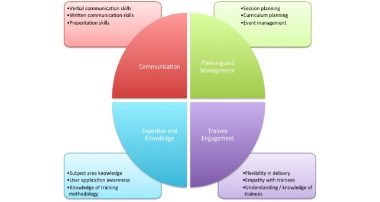

#ELIXIR – EXCELERATE Train-the Trainer subtask

## Session 2: Training techniques that can be used to enhance learner engagement and participation

 * [What makes a good training session?](#goodsession)
 * [Delivering a learning event as a mission; establishing learning mode, teamwork and mutual trust;](#delivering)
 * [What makes a good trainer?](#goodtrainer)
 * [The GOBLET skills matrix for trainers](#gobletmatrix)
 * [Teaching as a preformance art: promoting learner engagement;](#teaching)
 * [Motivation and demotivation;](#motivation)
 * [Self-confidence and usage independence;](#self)
 * [The seven principles of learning](#principles)
 * [Integrating active learning strategies into your course. Learning by doing.](#learning)
 * [Gamification;](#games) * 
 * [Carpentry teaching practices](#carpentry) (http://swcarpentry.github.io/instructor-training/15-practices/);
 * [The role of wrap-up sessions;](#wrap)

###What makes a good training session?

> ###Challenge 1: Training you have been involved in...

>- What makes a good training session?
>- What makes a bad training session?
>
>Think of an example of each that you have participated in and list your thoughts…
>

### Delivering a learning event as a mission; establishing learning mode, teamwork and mutual trust
Start with learning objectives. Once you have defined what learners need to achieve, let learning objectives lead the process.
The class space influences behaviours. The space in the training room can help to redefine how you implement learning objectives throughout the course.
Try to challenge yourself from more traditional, passive and instructor-led methods of teaching to more learner-centric methods that empower learners to be more engaged and involved in the process of skill development, mastery and application.
How can you use classroom space to turn challenges into opportunities for learning?
 
While a lecture or presentation mode can be used to kick-start a session, it can easily be followed by directing students to move to a different learning mode, to access content, their peers and the instructors to support learning. This dynamic interface stimulates both participants and instructors. 

Small groups, team-based exercises, and collaborative endeavours support a variety of learning modes.
Make sure to use clear and well developed protcolos that minimise any loss of time or productivity.
You can leverage multiple learning/teaching modes; indeed, fostering a high order of thinking skills is far more successful when students are given multiple ways to process information.  The variety of tools, flexibility of place to work and a range of people, including instructors, to network with at various intervals empower individuals and generate mutual trust. Provide students easier access to you (the instructor).

Try to give up the position of the "sage on the stage", to become the "guide on the side". This makes learners feel free to interact, ask questions, tell they got lost (when they are) and allows you to better understand what problems participants have,  work individually with those in need of help, and use your time to focus and (re)explain what was not well received.

###What makes a good trainer?

> ###Challenge 2: What makes a good trainer? 
Discuss it in pairs and write down which characteristics you think a good trainer should have.

>[Compare your thoughts with ours](#challenge2)

###Teaching as a preformance art: promoting learner engagement

####Interactive lectures and closed loop learning delivery

Lectures, as traditionally used in formal learning, are characterised by a unidirectional flow of information, from one instructor to N learners. Only in rare occasions is there information going back to the instructor. Moreover, the instructor is not necessarily worried about the result, i.e. if the information that is sent is sedimenting or not in the learners' brain. So, the instructor can speak for several hours in unidirectional mode.

In training, we also use lectures to convey information, but we make them short, and, n«more importantly we make them fit in a model of delivery that is called a closed loop. The instructor delivers information so that it can be immediately utilised in and exercise or some other form of assessment. The learner perceives the effect of the incoming information and his/her ability to use it, and has an opportunity to interact with the instructor, thus "closing the loop". The instructor uses this mode to ensure that the new knowledge or skill is well sedimented in the learner's brain, and corrects whatever is needed.

>
>#### Interactive lectures as described by the Science Education Resource Center at Carleton College ([SERC] (http://serc.carleton.edu/index.html))
>
>We quote from [the SERC portal for Educators](http://serc.carleton.edu/sp/library/interactive//index.html):
>
>Interactive lectures are classes in which the instructor breaks the lecture at least once per class to have students participate in an activity that lets them work directly with the material. The instructor might begin the interactive segment with an engagement trigger (thought-provoking questions, evocative visuals, physical props, cartoons, photographs, evocative textual passages, clips) that captures and maintains student attention.
>
>An interactive lecture is an easy way for instructors to intellectually engage and involve students as active participants in a lecture-based class of any size. Interactive lectures are classes in which the instructor breaks the lecture at least once per class to have students participate in an activity that lets them work directly with the material.
>
* The instructor might begin the interactive segment with an engagement trigger that captures and maintains student attention.
* Then the instructor incorporates an activity that allows students to apply what they have learned or give them a context for upcoming lecture material.
* As the instructor feels more comfortable using interactive techniques he or she might begin to call upon a blend of various interactive techniques all in one class period.
>
>####Why use interactive lecture?
Lecturing is a time-honored teaching technique that is an efficient method to present large amounts of content in classes of any size and it is efficient for sharing information with large numbers of students, but may result in students who listen passively.
>
* Making lectures interactive by including techniques such as think-pair-share, demonstrations, and role playing, can foster active engagement and enhance the value of the lecture segments.
* Using techniques that allow all of the students to participate, instead of having individual students answer questions when called on, will promote student retention and learning of the material presented during lecture, give students practice in developing critical-thinking skills, and enable instructors to assess how well the class is learning that day.
* Breaking up the lecture with these techniques not only provides format change to engage students, these activities allow students to immediately apply content and provides feedback to the instructor on student
>
>####How to give an interactive lecture
Giving an interactive lecture involves creating and delivering an effective segmented lecture with engagement triggers and well-selected interactive lecture techniques.
>
>* The instructor must begin by giving attention to pre-instructional planning and various classroom management and logistical issues that allow for modification from the traditional lecture format. Learning goals must be established for interactive lecture techniques, the instructor must determine what types of tasks will be involved and what sort of engagement trigger might be appropriate for the activity (see more about establishing learning goals).
>* Next, an interactive lecture technique must be selected and adapted for the specific course and content and attention must be given to how student feedback will be collected. In the most interactive of lectures, the instructor's traditional contributions would be short and the interactive activities could be both planned and spontaneous. 

The TtT taskforce of the Global Organisation for Bioinformatics Learning, Education and Training ([GOBLET] (http://mygoblet.org)), developed a skills matrix for trainiers. It aims to provide an  overview of the major skills required to be a good trainer; note that not all trainers will have all skills - that is not the point! 

> ###Challenge 3: The GOBLET skills matrix for trainers
> 1. Try to reflect on your current skills and how they fit with this matrix.  
> 
> 2. Then share your thoughts with us.

>####Communication skills
>*Verbal communication skills* - able to deliver information orally in a clear manner that is understood by trainees.
>*Written communication skills* - providing written information eg handouts, at the correct level for trainees and in appropriate format
>*Presentation skills* - producing suitable slide-sets for lecture-style sessions; presenting complex information in an accessible manner
>
>####Expertise and knowledge
>*Subject area knowledge* - having knowledge / expertise in a specific subject
>*User application awareness* - understanding how a learner will apply the information "How will this analysis benefit my work?"
>*Knowledge of training methodology* - awareness of individual learning styles and basic pedagogy
>
>####Planning and Management
>*Session planning* - able to define the requirements for a single session; be able to plan appropriate activities based on objectives of session and time available;
>*Curriculum planning* - organising a balanced course; clear definitions of target group and course outcomes; appropriate mix of theory and practice;
>*Event management* - "everything else" around the science in a course eg appropriate breaks, running times, networking opportunities.
>
>####Learner engagement
>*Flexibility in delivery* - adapting a session /  course based on real-time in class feedback;
>*Empathy with learners* - recognising how learners are engaging with the subject; drawing learners in to the learning opportunity presented;
>*Understanding / knowledge of learners* - understanding learners' requirements from the course.

###Motivation and demotivation

In general terms, as an instructor, if you feel that you need to motivate learners you should stop and think. There must be something wrong. You may be unable to identify the reason but this should be seen as a signal not to continue. You should not need to motivate people that fall in yor hands, but if you do, you should have a strategy in place for that. Start with figuring out the level of the audience and what could grab their interest.

You should identify factors that may demotivate your audience and build plans to avoid them. Factors that relate to delivery format are a particular concern, as they can ruin training that has been carefully built, content-wise. Lengthy lectures, over-crowded slides, lack of materials to follow-up are good examples. 

---
> The lesson on [Motivation and Demotivation](http://swcarpentry.github.io/instructor-training/16-motivation/) from the [Software/Data Carpentry Instructor training](http://swcarpentry.github.io/instructor-training/) is a very interesting reading on the topic. Here is a list of strategies for motivating learners from this lesson:
> 
    Strategies to establish value:
      - Connect the material to students’ interests.
      - Provide authentic, real-world tasks.
      - Show relevance to students’ current academic lives.
      - Demonstrate the relevance of higher-level skills to students’ future professional lives.
      - Identify and reward what you value.
      - Show your own passion and enthusiasm for the discipline.
    Strategies to build positive expectations:
      - Ensure alignment of objectives, assessments, and instructional strategies.
      - Identify an appropriate level of challenge.
      - Create assignments that provide the appropriate level of challenge.
      - Provide early success opportunities.
      - Articulate your expectations.
      - Provide rubrics.
      - Provide targeted feedback.
      - Be fair.
      - Educate students about the ways we explain success and failure.
      - Describe effective study strategies.
    Strategies for self-efficacy:
      - Provide flexibility and control.
      - Give students an opportunity to reflect.

> 

The techniques that can be used to keep motivation up in an audience are called engagement.

Examples of techniques that you can use to promote engagement in training:

* Establish teamwork by agreement
* Introduce blended multi-media materials 
* Make frequent use of instant feedback to monitor and to induce self-assessment
* Offer participatory stimuli (prizes, gamifications)
* Let learners doing recaps (in the morning about the day before, at the end of sessions, etc)
* Introduce physical exercise (e.g. at the beginning of after-lunch sessions): this is good for both physical and mental health
* Introduce short, relaxing breaks (e.g. one minute meditation)
* Assign tasks to groups (e.g. Python libraries) and let the groups present the result of their work

###The seven principles of learning

> **See also**: [Brent R and Felder RM (2011)](docs/how_learning_works_thoughts.pdf)
>
- **Principle P1**:	Students' prior knowledge can help or hinder learning.
- **Principle P2**:	How students organise knowledge influences how they learn and apply what they know.
- **Principle P3**:	Students motivation determines, directs and sustains what they do learn.
- **Principle P4**:	To develop mastery, students must acquire component skills, practice integrating them, and know when to apply what they have learned
- **Principle P5**:	Goal-directed practice coupled with targeted feedback enhances the quality of students' learning
- **Principle P6**:	Students' current level of development interacts with the social, emotional, and intellectual climate of the course to impact learning
- **Principle P7**:	To become self-directd leaners, students must learn to monitor and adjust their approaches to learning.
>
>**Instructional strategies that collectively address all seven principles (P1-P7)**:
>
- **Strategy S1**: Collect data about students and use it to design instruction (P1,P3).
- **Strategy S2**: Be explicit about your learning goals, learning objectives and expecations (P3, P5, P6). Make your learning goals challenging but attainable by most of the learners in your course. Write detailed learning outcomes that spell out what the learners should be able to do (define, explain, calculate, model, critique, design,...) if they have aquired the knowledge and skills you are trying to help them to develop, and share your objectives with the learners.
- **Strategy S3**: Scaffold complex tasks (P2-P7). Teach and test at a level that is challenging but not too far above the learners' current klnowledge and skill levels.
- **Strategy S4**: Help learners learn to funcion like experts (P2, P4, P7). Have learners formulate solution strategies before beginning to work on new problems, and when they complete assignments have them reflect on what they learned and what they will do differently in the future.
- **Strategy S5**: Establish a supportive class climate (P3, P6). Learn and use learners' names and encourage them to interact with you in and out the course. Collect anonymous learner feedback and investigate and respond to any complaints related to class climate.

###Integrating active learning strategies into your course. Learning by doing.

Consider ways to set clear expectations, design effective evaluation strategies and provide helpful feedback.

> We quote from [Richard M Felder and Rebecca Brent](./docs/active_learning_an_introduction.pdf): 
>
>If you think of anything a teacher might ask students to do — answer questions in class,complete assignments and projects outside class, carry out lab experiments, or anything else other than sitting passively in a classroom — you will find people who would classify it as active learning. We find that a more restricted definition limited to in-class activities is more useful: 
>
>*Active learning is anything course-related that all students in a class session are called upon to do other than simply watching, listening and taking notes.*
>
>You are doing active learning in your class when:
> 
* you ask a question, pose a problem, or issue some other type of challenge; 
* tell your students to work individually or in small groups to come up with a response; give them some time to do it; 
* stop them, and call on one or more individuals or groups to share their responses. 
>
>You are **not** doing active learning when: 
>
* you lecture, 
* ask questions that the same few students always answer, 
* or conduct discussions that engage only a small fraction of the class.  
>
>We are not about to propose that you throw out lecturing and make every class you teach a total active learning extravaganza. You know more than most of your students do about your subject, and you need to spend part of your class time teaching them what you know - explaining, clarifying, demonstrating, modeling, etc. 
>
>What we are suggesting is that **you avoid making lecturing the only thing you do**. If a lecture or recitation session includes even a few minutes of relevant activity — a minute here, 30 seconds there —the students will be awake and with you for the remaining time in a way that never happens in a traditional lecture, and most will retain far more of what happens in those few minutes than of what you say and do in the rest of the session.

Our experience suggests that there are activities that should be reduced and activities that should be carried out as much intensively as possible.

**Activities and attitudes the instructor should keep to a minimum**:

- lecturing
- individual work out
- providing answers before letting participants doing it
- keeping the same pace for long time
- using a monotone modality of content delivery (including the tone of the voice)
- showing no enthusiasm

**Activities and attitudes the instructor should promote**:

- listening
- questions asking
- challenging learners
- group discussions/brainstorming
- work in pairs/groups
- problem solving
- peer instruction (using sticky notes, see below Carpentry teaching practices)
- participants' interaction/neworking
- games
- physical exercise
- presentations by participants
- mode/pace/activity frequent change

See also: [The Eberly Center for Teaching Excellence and Educational Innovation ](http://www.cmu.edu/teaching/)

###Gamification
Using games in training may be an effective technique in many aspects.
Games promote:

* ice breaking
* interactivity
* networking
* fun
* pace discontinuity
* relax

Games should be designed/chosen accurately and have specific goals, should not last too much and shouln't be too frequent.
Possible games are:

* **Throw props to recap/rehearse:** Make a list of concepts/keywords and write it on the whiteboard (or a flipchart). You may also have cards stuck on the wall of the classroom with terms written on them. Throw a light and soft object to a participant, who will have catch the object, stand up, pick a term from the list and explain its meaning (or usage) in a few sentences (not more than 20-30 seconds). After the explanation, the participant will throw the object to another participant. Continue until the end of the list.
* **Mimicking**. Make two groups. One person from each group will mimic concepts/keywords (e.g. Python commands). The rest of the group will guess the mimicked concept/keyword. The group employing less time to guess the correct concept/keyword, will get one point. In principle, this should be repeated for each component of the group. This game can also be done without splitting the audience in two groups. 
* **Asking (and answering) questions to each other:** This activity, should the venue and the weather allow it, would be better carried out in outer space. Form two concentric circles of people facing each others. When you clap your hands, the two circles have to turn in opposite directions. A second clap will stop them and each person from the outer (inner) circle will ask a question to the person before him/her and belogning to the inner (outer) circle. Give 45 secs to answer, then clap again your hands to make people move and again to stop them. When they stop (ensure that facing pairs have changed), people from the inner (outer) circle will ask questions and those from the outer  (inner) circle will answer. Repeat for 4-6 questions (and answers).
* **Games to introduce algorithms and/or the logic of programming (i.e., simple but accurate and very specific instructions)**. *Game 1*: divide the class into two groups. Each group will draw a simple geometrical figure and write specific istructions to draw the figure. Groups exchange instructions and try to draw the other group's figure based on the instructions received.
*Game 2*: One person (could also be the instructor) will stand blindfolded in a corner (or at the back) of the classroom. Following instructions of participants, he or she will have to walk to the opposite corner (or the front) of the classroom, without bumping into tables, chairs, etc.

---

>###Carpentry teaching practices
>Very effective teaching practices are described in the [Teaching practices lesson] (http://swcarpentry.github.io/instructor-training/15-practices/) from the [Software/Data Carpentry Instructor training](http://swcarpentry.github.io/instructor-training). 

>Here is a short extract: 

>**Sticky notes**:
We give each learner two sticky notes of different colors, e.g., red and green. These can be held up for voting, but their real use is as status flags. If someone has completed an exercise and wants it checked, they put the green sticky note on their laptop; if they run into a problem and need help, the put up the red one. This is better than having people raise their hands because: 

>* it’s more discreet (which means they’re more likely to actually do it), 
* they can keep working while their flag is raised, and * the instructor can quickly see from the front of the room what state the class is in.

>**Minute cards**:
We also use sticky notes as minute cards: before each coffee or meal break, learners take a minute to write one positive thing on the green sticky note (e.g., one thing they’ve learned that they think will be useful), and one thing they found too fast, too slow, confusing, or irrelevant on the red one. They can use the red sticky note for questions that haven’t yet been answered. It only takes a few minutes to cluster these, and allows the instructors to adjust to learners’ interests and speed.

>**One up, one down**:
We frequently also ask for summary feedback at the end of each day. The instructors ask the learners to alternately give one positive and one negative point about the day, without repeating anything that has already been said. This requirement forces people to say things they otherwise might not: once all the “safe” feedback has been given, participants will start saying what they really think.

>Minute cards are anonymous; the alternating up-and-down feedback is not. Each mode has its strengths and weaknesses, and by providing both, we hope to get the best of both worlds.
>
---
> ###Things that an instructor shouldn't do in a course 
> > From: [Motivation - Software/Data Carpentry Instructor training](http://swcarpentry.github.io/instructor-training/19-motivation/)

> - Tell learners they are rubbish because they use Excel and/or Word don't modularize their code, etc.
> - Repeatedly make digs about Windows and praise Linux, e.g., say that the former is for amateurs.
> - Criticise GUI applications (and by implication their users) and describe command-line tools as the One True Way.
> - Dive into complex or detailed technical discussion with the one or two people in the audience who clearly don't actually need to be there.
> - Pretend to know more than you do. People will actually trust you more if you are frank about the limitations of your knowledge, and will be more likely to ask questions and seek help.
> - Use the J word ("just"). This signals the learner that the instructor thinks their problem is trivial and by extension that they therefore must be stupid for not being able to figure it out.
> 

---

###The role of wrap-up sessions
At the end of sessions (or a day course, or the whole course), it is important to devote a few minutes to wrap-up and collect feedback.
Wrap-up should be carried out by participants. 
In a course lasting more than one day, the wrap-up of one entire day, can be carried out as the first thing on the day after. The various topics of a day can be assigned to a few participants (it is advised to identify max 4/5 main topics each day and assign each to a different participant), who will stand on the stage before the class and briefly summarise what was done the day before. The instructor may decide to give the participants who have to present a bit of time to reflect and organise a bried speach. 
If you mean to use this type of wrap-up, it is important to inform the participants at the beginning of the course about your intention: many people don't like to be exposed and may feel uncomfortable if not irritated by knowing they have to do something they don't like with short or no notice. 
Usually they accept talking in front of the class if they have time to adapt to this idea *and* you explain them what are their benefits in doing this.

Feedback at the end of each session should be quick and simple. One example approach is the fist of five voting, which is described in the [session on assessment](./TtT_session_4.md).  

##Challenges: discussion

<a name="challenge2">Challenge 2</a>:
What makes a good trainer? 

- Knowledge of subject
- Clear aims for session outcomes
- Confidence in delivery
- Appropriate delivery
- Listens to trainees 
- Flexible – can change pace / depth if required
- Approachable
- Engaging
