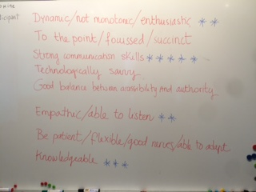

# Train the Trainer in Portugal - 2016
#GTPB – The Gulbenkian Training Programme in Bioinformatics
#ELIXIR – EXCELERATE Train-the Trainer subtask

## terminology
- learners... TBC

## objectives and outcomes
key objects and key outcome separately

smart learning outcomes
share objectives and outcomes with students at any stage
 ... TBC

## how learning works
way to deliver :  read \, prepare slides, deliver lecture

## about training sessions
What makes a good training session? 
What makes a bad training session?

## what makes a good trainer

## skills matrix for trainers: which skills do you have?

# 12 July

1) Provide a printed cheatsheet with Python commands
2) As for Parsing-I and Parsing-II challenges, specify it is a single task split in chunks (= challenges)
3) Assign more challenges together and give more time
4) As for the "write instructions to draw the figure" game, provide the figure in advance a make smaller groups
